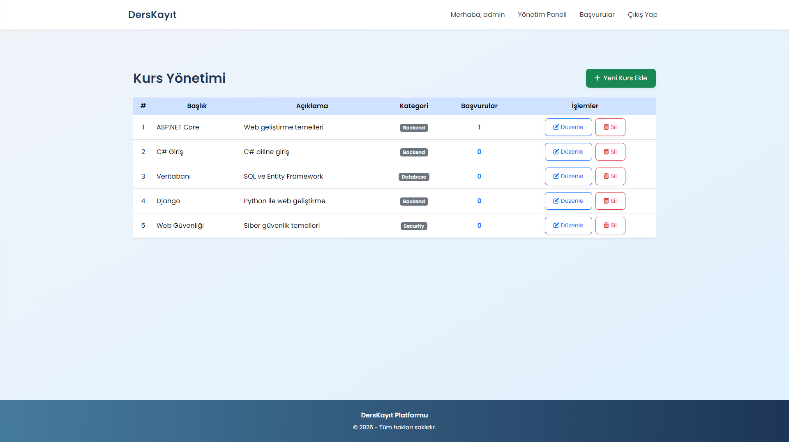
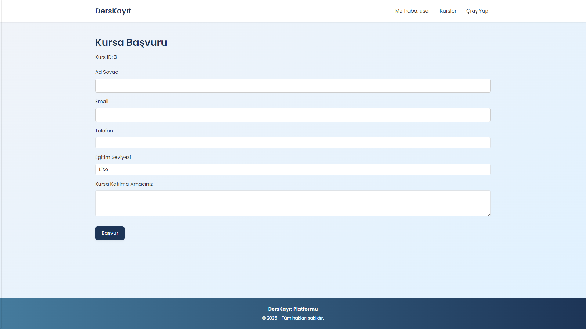
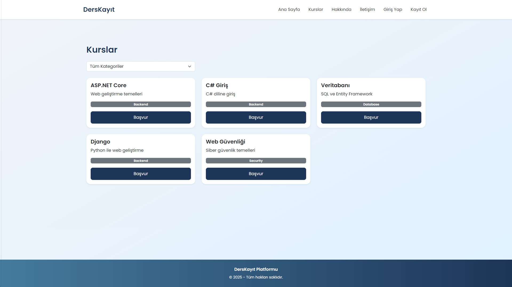
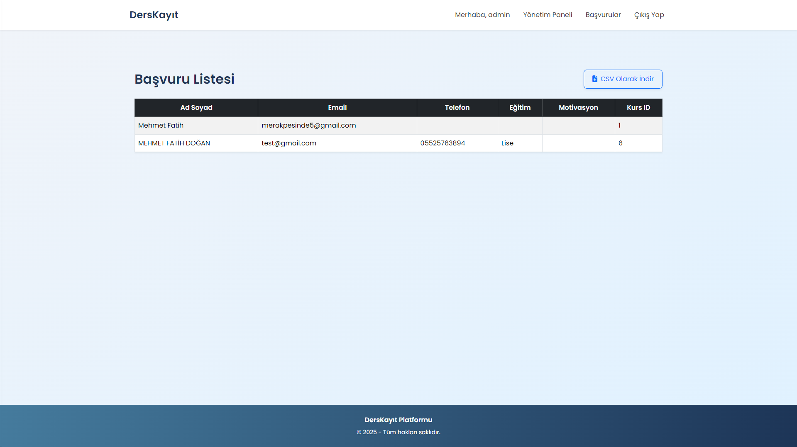

# DersKayit

Bu proje, ASP.NET Core MVC kullanılarak geliştirilmiş bir ders kayıt uygulamasıdır. Kullanıcılar sistemdeki derslere göz atabilir, kayıt olabilir ve yöneticiler yeni dersler ekleyebilir.

## Özellikler

- Kullanıcı Girişi ve Kayıt
- Ders Listeleme
- Ders Kayıt İşlemi
- Admin Paneli (Ders Ekleme/Silme/Güncelleme)
- Responsive Tasarım

## Gereksinimler

- [.NET 9 SDK](https://dotnet.microsoft.com/download/dotnet/9.0)
- [Visual Studio 2022](https://visualstudio.microsoft.com/vs/) veya [Visual Studio Code](https://code.visualstudio.com/)

## Kurulum

1. Repoyu klonlayın:
   ```bash
   git clone https://github.com/fatihdogann/DersKayit.git
   cd DersKayit
   ```

2. Projeyi çalıştırın:
   ```bash
   dotnet run
   ```

3. Tarayıcınızda `https://localhost:5001` adresine gidin.

## Kullanım

- Admin girişi için: 
  - Kullanıcı Adı: `admin`
  - Şifre: `admin123`
  
- Normal kullanıcı girişi için:
  - Kullanıcı Adı: `user`
  - Şifre: `user123`

## Ekran Görüntüleri

<<<<<<< HEAD




=======
(screenshots/1.png)
(screenshots/2.png)
(screenshots/3.png)
(screenshots/4.png)
>>>>>>> 5eb5a7d12214e98ca1f89a7f8ee9194f41221c47

## Katkıda Bulunma

1. Forklayın
2. Yeni bir branch oluşturun (`git checkout -b feature/yeni-ozellik`)
3. Değişikliklerinizi commit edin (`git commit -am 'Yeni özellik eklendi'`)
4. Branch'inizi push edin (`git push origin feature/yeni-ozellik`)
5. Yeni bir Pull Request oluşturun

## Lisans

Bu proje MIT Lisansı ile lisanslanmıştır. Daha fazla bilgi için `LICENSE` dosyasına bakınız.
